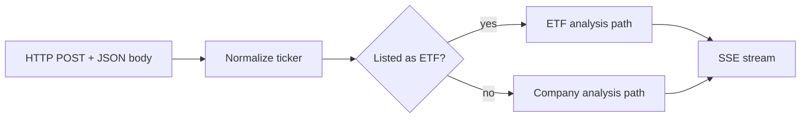
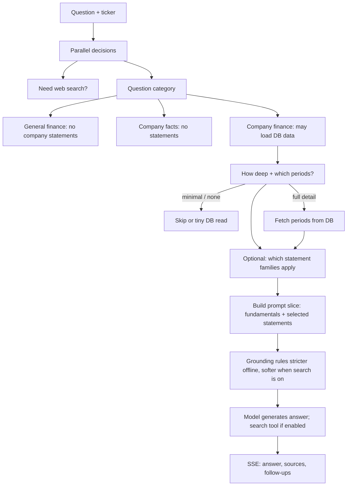

# `POST /api/companies/{ticker}/analyze` — request flow

**Product context:** *Skip/Minimize Financial Context for Search-Only Questions* — reduce irrelevant DB financial blobs when the answer should come mainly from the web; keep hybrid cases safe.

High level: the client sends a question (and optional conversation). The API streams **Server-Sent Events** (thinking steps, optional search metadata, answer chunks, sources, related questions).

---

## 1. Entry and routing

Both paths share the same **search on/off** decision concept; only the **company** path loads **statement data** from the database.

---

## 2. Company path (where financial context matters)

**Ideas from the plan (already reflected in behavior):**

- If the DB **cannot** supply the granularity asked (e.g. segment revenue breakdown), classify as **no statement payload** so the model is not forced to cite aggregates only.
- If detail is needed but only **one** statement family is relevant (e.g. revenue trend), **drop** the other families from the prompt instead of dumping all three.
- **Search on** and **strict “only cite provided numbers”** in the same prompt is avoided; when search is enabled, instructions allow using the web for gaps.

---

## 3. What the client sees (SSE)

Rough order (not every event on every request):

1. Conversation id (if new).
2. Short **thinking** lines (classification, search, data load, analysis).
3. Optional **search decision** metadata (on/off, short reason).
4. **Answer** text (streamed).
5. Optional **charts / visuals** as separate events.
6. **Sources** (filings vs URLs).
7. **Related questions**, **model id** — end of stream.

---

*Keep this doc conceptual; implementation details live in code and change often.*