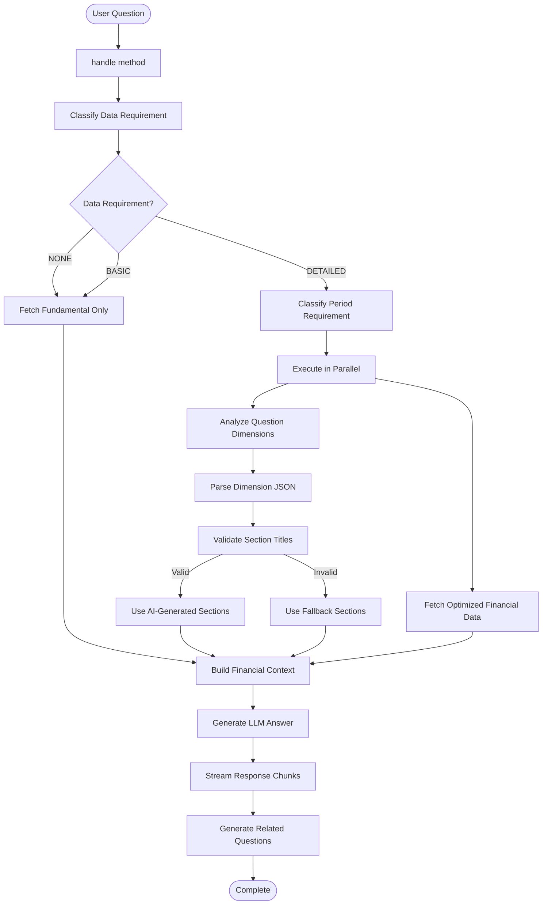
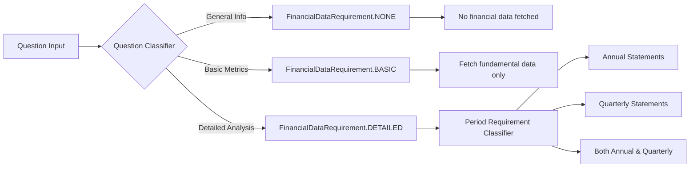
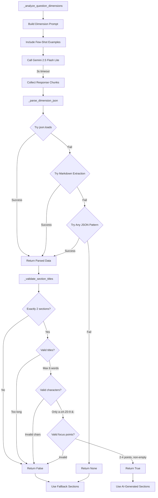
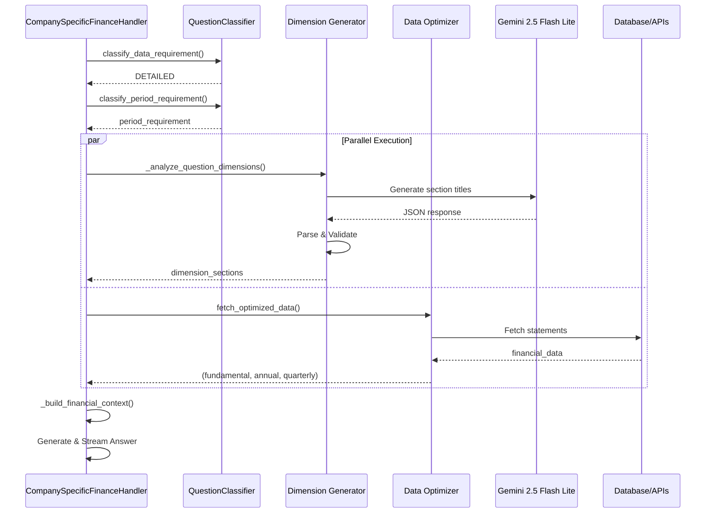
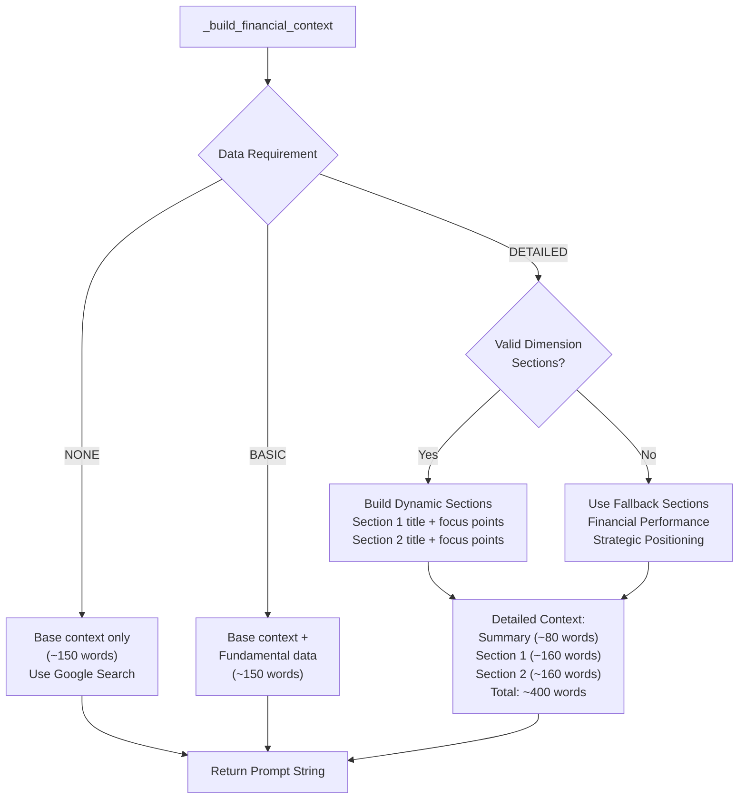
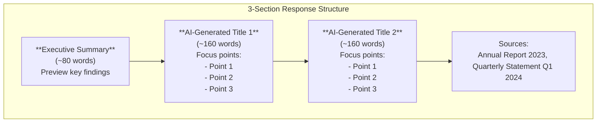
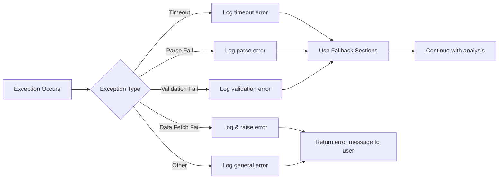

# CompanySpecificFinanceHandler Flow Documentation

## Overview

The `CompanySpecificFinanceHandler` processes company-specific financial questions with AI-driven dynamic section generation and optimized data fetching.

## Main Flow

## Data Requirement Classification

## Dimension Analysis Flow (AI-Generated Sections)

## Parallel Execution Pattern (DETAILED queries only)

## Context Building Logic

## Section Structure (DETAILED Analysis)

## Key Features

### 🎯 Dynamic Section Generation
- AI analyzes each question to generate 2 relevant section titles
- 3-second timeout with fallback to generic sections
- Validates title length (max 6 words) and structure

### ⚡ Parallel Execution
- Dimension analysis runs concurrently with data fetching
- Reduces latency by ~1-2 seconds for DETAILED queries

### 📊 Tiered Data Fetching
- **NONE**: No financial data
- **BASIC**: Fundamental data only
- **DETAILED**: Full statements (annual/quarterly/both)

### ✅ Robust JSON Parsing
1. Direct `json.loads()`
2. Markdown code block extraction
3. Regex pattern matching
4. Fallback to default sections

### 📝 Word Allocation
- Summary: 80 words
- Section 1: 160 words
- Section 2: 160 words
- **Total: ~400 words** (configurable)

## Error Handling

## Performance Profiling Points

The handler tracks execution time at key stages:
- **Time to First Token (TTFT)**: Time from prompt to first response chunk
- **Model Generation**: Total LLM generation time
- **Related Questions**: Time to generate follow-up questions
- **Total Handler Time**: End-to-end execution time

All metrics are logged with `logger.info()` for observability.
